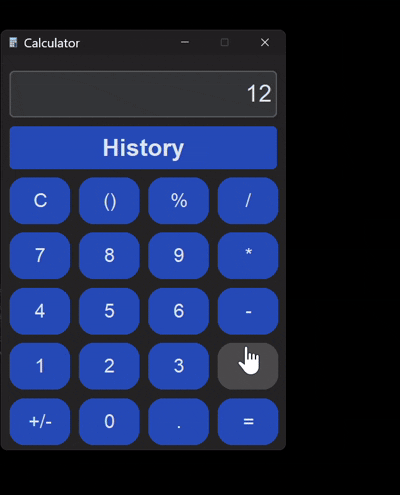

# 🧮 CTk Calculator with History (Python GUI Project)

This project is a modern and stylish calculator built using `CustomTkinter`, featuring:

- A clean graphical interface 🖥️
- History logging of calculations 📜
- Data storage using SQLite 🗃️
- Support for basic arithmetic operations ➕➖✖️➗

---

## 📌 Features

- Real-time equation input
- Dark mode theme
- Evaluation of expressions (e.g., `7 + 3`, `8 * 4`, `9 % 2`, etc.)
- Automatic database logging with timestamp
- View recent 50 history entries in a separate window

---

## 🗃️ Tech Stack

- **CustomTkinter**: Modern GUI components
- **SQLite3**: Embedded database for history
- **Pillow (PIL)**: Image support for custom icon
- **Python built-in libraries**: `os`, `datetime`

---

## 📂 Project Structure

```
calculator-app/
├── calculator.py         # Main app file
├── logo.png              # Icon image for the GUI window
├── calculator.db         # SQLite database for storing history (auto-created)
├── README.md             # This file
├── requirements.txt      # Library dependencies
```

---

## 🧠 How It Works

1. Launches a **CustomTkinter window** with styled buttons
2. Users input expressions by clicking buttons
3. Pressing "=`" evaluates the expression using `eval()\`
4. Results along with the operands and operation are saved to SQLite
5. Clicking the **History** button opens a new window displaying the last 50 calculations

---

## 💡 Functions

### `show(value)`

Adds the selected character to the current expression.

### `clear()`

Clears the entire input field and resets to "0".

### `toggle_sign()`

Toggles the sign of the current number (positive/negative).

### `solve()`

Parses the expression, calculates the result using `eval`, and stores the operation in the database.

### `history_window()`

Opens a `CTkToplevel` window and loads the latest 50 calculations from SQLite.

### `save_history(operand1, operation, operand2, result)`

Inserts a new record into the `history` table with timestamp.

---

## 📝 Example History Entry

```
[2025-07-15 12:20:45]: 8 * 5 = 40.0
[2025-07-15 12:21:10]: 12 / 4 = 3.0
```

---

## ✅ Prerequisites

- Python 3.9 or higher
- Tkinter pre-installed

---

```bash
📃 Requirements.txt
```

Below is the required `requirements.txt`:

```
customtkinter==5.2.1
pillow==10.3.0
```

SQLite and other libraries (`os`, `datetime`) are built-in with Python.

---

## 📸 Videos



---
